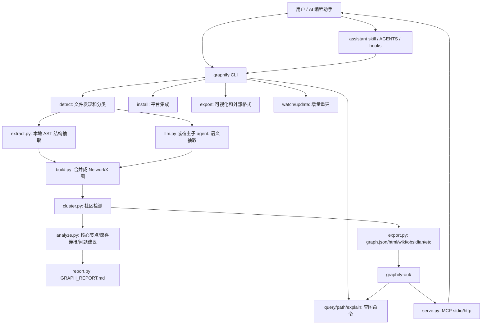
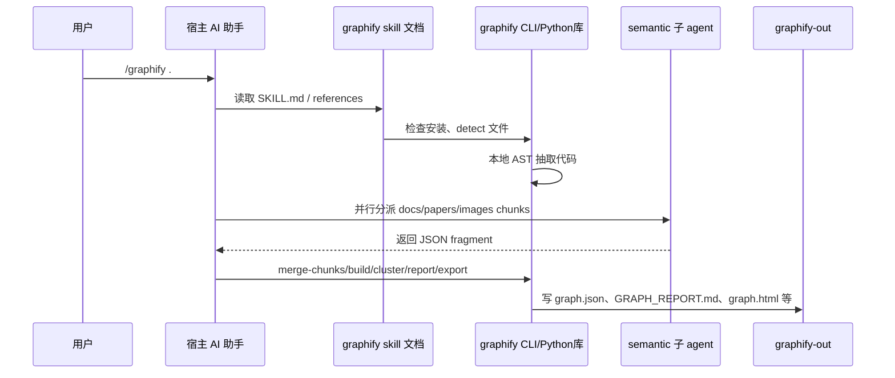

# graphify 架构详细分析

生成时间：2026-06-20
目标仓库：`E:\Github_Projects\graphify`
输出项目：`E:\AI_Projects\StoryGraph`

## 1. 结论先行

`graphify` 的核心定位不是“自己启动一个全自动长期运行的智能体”，而是“给各种 AI 编程助手加一层代码库记忆”。它把一个文件夹里的代码、文档、论文、图片、音视频、数据库 schema 等内容抽成知识图谱，然后让后续问题变成查图，而不是每次重新读全仓库。

用大白话说：

1. 先扫文件：哪些是代码、哪些是文档、哪些是图片、哪些要忽略。
2. 代码文件走本地解析：用 tree-sitter 等工具直接抽函数、类、导入、调用关系，不需要 LLM。
3. 文档、论文、图片这类“语义内容”走智能体或 LLM：让宿主 AI 助手的子 agent 或直接 API 后端读文件，产出节点和边。
4. 合并成图：把所有片段合并成 NetworkX 图，再写成 `graphify-out/graph.json`。
5. 聚类和报告：把图分成社区，找核心节点、意外连接、问题建议，生成报告、HTML、Obsidian、Wiki、GraphML、Neo4j/FalkorDB 等输出。
6. 后续问图问题：`graphify query/path/explain` 和图查询类 MCP 工具主要读取 `graph.json`，用 BFS/DFS/最短路径把相关子图吐给 AI 助手；MCP 的 PR 类工具不是纯 graph artifact 查询，还会读取 GitHub PR、repo/worktree 状态和 PR 文件列表。

智能体能力主要出现在两处：

1. **宿主智能体编排**：用户在 Claude Code、Codex、Amp、Trae 等环境里执行 `/graphify` 或 `$graphify`，宿主 assistant 读取 graphify 安装进去的 skill 文档，分派子 agent 并行处理文档/论文/图片。
2. **直接 LLM API**：用户直接跑 `graphify extract . --backend ...` 时，代码自己调用 Gemini、Kimi、Claude、OpenAI-compatible、DeepSeek、Ollama、Azure、Bedrock、Claude CLI 等后端。

所以它是“工具库 + CLI + assistant skill + MCP 服务”的组合体。代码内核负责扫描、解析、建图、导出；智能体负责在宿主环境里执行流程、读复杂语义文件、命名社区、引导查询。

## 2. 分析范围、证据和置信模型

本分析只读检查了 `E:\Github_Projects\graphify`，未修改 graphify 仓库，未启动真实 MCP 服务，也未跑完整测试。结论基于源码、文档、测试文件和 pyproject 配置，并参考按四个并行审查视角整理的辅助线索；未附原始输出的视角梳理不作为可复核证据来源。

置信标签：

- **已证实**：有源码、配置、文档或测试锚点。
- **强推断**：由调用链、文件命名、测试覆盖和数据流组合推断，尚未实际运行验证。
- **未知**：仓库静态证据无法证明，或需要外部宿主/真实 API/运行环境验证。

主要证据入口：

- `E:\Github_Projects\graphify\pyproject.toml`
- `E:\Github_Projects\graphify\README.md`
- `E:\Github_Projects\graphify\ARCHITECTURE.md`
- `E:\Github_Projects\graphify\docs\how-it-works.md`
- `E:\Github_Projects\graphify\graphify\__main__.py`
- `E:\Github_Projects\graphify\graphify\extract.py`
- `E:\Github_Projects\graphify\graphify\llm.py`
- `E:\Github_Projects\graphify\graphify\build.py`
- `E:\Github_Projects\graphify\graphify\serve.py`
- `E:\Github_Projects\graphify\graphify\skill.md`
- `E:\Github_Projects\graphify\graphify\skill-codex.md`
- `E:\Github_Projects\graphify\tests\test_*.py`

## 3. 总体架构鸟瞰

### 3.1 四层架构



四层可以这样理解：

| 层 | 责任 | 典型文件 | 证据 |
|---|---|---|---|
| 宿主集成层 | 把 graphify 安装到 Claude/Codex/Amp/Trae 等助手里，提供 `/graphify` 或 `$graphify` 的流程说明 | `skill*.md`、`skills/*/references/*.md`、`always_on/*.md`、`__main__.py` install 分支 | `pyproject.toml:77`、`pyproject.toml:110`、`graphify/__main__.py:628` |
| CLI 编排层 | 接收命令，分发 install/update/extract/query/export/global 等流程 | `graphify/__main__.py` | `graphify/__main__.py:2090`、`graphify/__main__.py:2282` |
| 图构建内核 | 文件检测、本地 AST 抽取、LLM 语义抽取、建图、聚类、分析 | `detect.py`、`extract.py`、`llm.py`、`build.py`、`cluster.py`、`analyze.py` | `ARCHITECTURE.md:5`、`extract.py:12554`、`llm.py:1292`、`build.py:338` |
| 查询和输出层 | 查询图、MCP 服务、HTML/Obsidian/Wiki/GraphML/数据库输出 | `serve.py`、`export.py`、`report.py`、`wiki.py`、`tree_html.py`、`callflow_html.py` | `serve.py:513`、`export.py:484`、`report.py:15` |

### 3.2 官方描述和当前实现的差异

`ARCHITECTURE.md` 里把主 pipeline 写成：

```text
detect() -> extract() -> build_graph() -> cluster() -> analyze() -> report() -> export()
```

这个描述对核心建图流程是准确的，但它低估了当前实现的真实复杂度。现在的仓库还包含：

- 多平台 skill 安装和卸载。
- Codex/Claude/Gemini/CodeBuddy 等 hook 或规则文件。
- MCP stdio 和 Streamable HTTP 服务。
- global graph 用户级全局图。
- provider registry 自定义 LLM 后端。
- PR 影响分析。
- PostgreSQL、Cargo、MCP config、package manifest、Google Workspace、video/audio 等额外入口。

结论：`ARCHITECTURE.md` 描述的是“内核模型”，实际系统已经是“内核 + 多平台外壳 + 服务端 + 多种输出”的产品化架构。置信度：强推断，证据见 `ARCHITECTURE.md:5`、`graphify/serve.py:1198`、`graphify/global_graph.py:10`、`tools/skillgen/gen.py:4`。

## 4. 入口点和命令地图

### 4.1 Python 包入口

`pyproject.toml` 定义了两个 console script：

| 命令 | 入口 | 用途 | 置信度 |
|---|---|---|---|
| `graphify` | `graphify.__main__:main` | 主 CLI：安装、抽取、查询、导出、增量更新 | 已证实，`pyproject.toml:77` |
| `graphify-mcp` | `graphify.serve:_main` | MCP stdio/http 服务入口 | 已证实，`pyproject.toml:78` |

另一个事实很重要：源码里没有独立的 `graphify build`、`graphify report`、`graphify serve` 主 CLI 子命令。`build` 和 `report` 是内部阶段；MCP 正式入口是 `graphify-mcp` 或 `python -m graphify.serve`。置信度：已证实，见 `graphify/__main__.py:2294`、`graphify/__main__.py:3953`、`graphify/serve.py:1255`。

### 4.2 主 CLI 分发方式

`graphify/__main__.py` 的 `main()` 从 `sys.argv` 读命令，然后用一个很长的 `if/elif cmd == ...` 手写分发。它不是标准 argparse 子命令树。这样做的直接后果是：

- 好处：安装器、平台兼容、历史命令、特殊参数可以很灵活地塞进一个入口。
- 代价：`__main__.py` 变成架构热点，CLI、安装、provider、extract、export、global、hook 等逻辑集中在一个 4700 行级别文件里。

证据：`graphify/__main__.py:2090` 定义 `main()`，`graphify/__main__.py:2282` 开始读取 `cmd`，`graphify/__main__.py:2294` 之后大量分支。

## 5. 核心模块职责

| 模块 | 大白话职责 | 主要状态 | 证据 |
|---|---|---|---|
| `detect.py` | 扫目录，判断每个文件是什么类型，处理 `.graphifyignore`、manifest、增量变化 | `manifest.json`、文件分类结果 | `detect.py:1236`、`detect.py:1339` |
| `extract.py` | 对代码文件做本地解析，抽类、函数、导入、调用关系 | AST extraction dict、AST cache | `extract.py:461`、`extract.py:12554` |
| `llm.py` | 对文档/论文/图片做语义抽取，或给社区命名、LLM 去重 | semantic extraction dict、token 统计 | `llm.py:59`、`llm.py:1292`、`llm.py:1690` |
| `build.py` | 把多个抽取片段合成 NetworkX 图，处理去重、旧格式兼容、增量合并 | NetworkX Graph/DiGraph | `build.py:136`、`build.py:338`、`build.py:430` |
| `cluster.py` | 给图分社区，优先 Leiden，缺依赖时降级 | `community` 节点属性 | `cluster.py:22`、`cluster.py:86` |
| `analyze.py` | 找 god nodes、惊喜连接、建议问题、图差异、导入循环 | analysis dict | `analyze.py:100`、`analyze.py:124`、`analyze.py:419` |
| `report.py` | 把图分析写成 `GRAPH_REPORT.md` | Markdown | `report.py:15` |
| `export.py` | 输出 `graph.json`、HTML、Obsidian、Wiki、SVG、GraphML、Cypher、Neo4j/FalkorDB | `graphify-out/*` | `export.py:484`、`export.py:631`、`export.py:1262` |
| `serve.py` | 把已有图通过 MCP 暴露给 AI 助手 | 内存中的 NetworkX 图，热重载状态 | `serve.py:513`、`serve.py:1041`、`serve.py:1198` |
| `watch.py` | 监听文件变化，代码变化自动重建，非代码变化提示需要更新 | `.rebuild.lock`、`.pending_changes`、`needs_update` | `watch.py:395`、`watch.py:871` |
| `cache.py` | AST 和 semantic 缓存 | `graphify-out/cache/*` | `cache.py:155`、`cache.py:271`、`cache.py:409` |
| `security.py` | URL、防 SSRF、图大小、label/metadata 清洗等安全边界 | 无长期业务状态 | `security.py:100`、`security.py:255`、`security.py:312` |
| `global_graph.py` | 用户级全局图，把多个项目图合在一起 | `~/.graphify/global-graph.json` | `global_graph.py:10`、`global_graph.py:77` |
| `hooks.py` | 安装 git post-commit/post-checkout 等钩子，触发增量更新 | `.git/hooks/*` | `hooks.py:413`、`hooks.py:450` |
| `tools/skillgen` | 生成不同平台的 skill 和 reference 文件 | `graphify/skill*.md`、`graphify/skills/*/references` | `tools/skillgen/gen.py:4` |

## 6. 主流程一：宿主 assistant 的 `/graphify` 路线

这是 README 最强调的路线：用户不一定直接敲裸 CLI，而是在 AI 编程助手里输入 `/graphify .` 或 Codex 里的 `$graphify .`。

### 6.1 流程图



### 6.2 具体步骤

1. 宿主助手先检查是否已有 `graphify-out/graph.json`。
   - 如果已有，且用户只是问代码库问题，skill 要求直接走 `graphify query`，不要重新抽取。
   - 证据：`graphify/skill.md:53`、`graphify/skill-codex.md:53`。

2. 如果需要新建图，先确保 graphify 已安装。
   - skill 会让宿主检查 Python 环境，写 `graphify-out/.graphify_python` 之类的解释器路径辅助文件。
   - 证据：`graphify/skill.md:65` 到 `graphify/skill.md:103`。

3. 运行 detect。
   - 文件被分成 code、document、paper、image、video 等。
   - 大白话：先把“要本地解析的文件”和“要给 LLM 看语义的文件”分出来。
   - 证据：`graphify/skill.md:107`、`docs/how-it-works.md:1`。

4. 代码文件本地抽取。
   - 这一步不需要 LLM，不发 API。
   - 用 `graphify.extract.extract()` 做 AST 提取，必要时多进程。
   - 证据：`graphify/skill.md:167`、`extract.py:12554`。

5. 文档、论文、图片语义抽取。
   - 如果是纯代码语料，跳过这一步。
   - 如果有非代码文件，skill 要求并行分派 semantic subagents。
   - 每个子 agent 读一批文件，输出 JSON：`nodes`、`edges`、`hyperedges`。
   - 证据：`graphify/skill.md:191`、`graphify/skills/codex/references/extraction-spec.md:1`。

6. 合并 chunk，构图、聚类、报告、导出。
   - AST 结果和 semantic 结果合并。
   - 生成 `graph.json`、`GRAPH_REPORT.md`、`graph.html` 等。
   - 证据：`graphify/skill.md:370`、`graphify/skill.md:424`、`graphify/skill.md:465`。

### 6.3 这个流程里智能体到底做什么

智能体不是负责解析 Python/JavaScript AST。那些是本地代码做的。

智能体主要负责：

1. **读 skill 文档并按步骤执行**：宿主 assistant 根据 `skill.md` 或 `skill-codex.md` 编排流程。
2. **并行语义抽取**：文档、论文、图片这类难以靠 AST 解析的输入，交给子 agent 读，输出图片段。
3. **处理上下文和命名**：例如社区命名、回答后续查询、引导用户沿图继续探索。
4. **在已有图时优先查图**：hook/AGENTS/CLAUDE/GEMINI 等规则会提醒助手不要盲目 grep 或读全仓库。

平台差异：

| 平台 | 子 agent 机制 | 输出方式 | 证据 |
|---|---|---|---|
| Claude 类平台 | `Agent` 工具 | 每 chunk 写 `.graphify_chunk_NN.json` | `graphify/skill.md:195`、`graphify/skill.md:231` |
| Codex | `spawn_agent + wait_agent + close_agent` | inline JSON，主 agent 汇总后写 `.graphify_semantic_new.json` | `graphify/skill-codex.md:231`、`graphify/skill-codex.md:248` |
| Amp/Droid/Trae | `Task` 或平台等价机制 | 平台相关 | `tools/skillgen/platforms.toml:106`、`:115`、`:160` |
| OpenCode | `@mention` 风格 | 平台相关 | `tools/skillgen/fragments/dispatch/opencode-mention.md:1` |
| Aider/部分平台 | 可能是顺序或手工变体 | 平台相关 | `README.md:151` |

置信度：已证实。外部平台真实是否严格执行 skill 文案，静态仓库无法证明，属于未知。

## 7. 主流程二：裸 CLI 的 `graphify extract`

`graphify extract` 是 headless 全流程抽取，适合 CI、脚本、没有宿主 assistant 的环境。它不会分派宿主子 agent，而是由代码直接调用 LLM 后端。

### 7.1 调用链

```text
graphify extract <path>
  -> detect() 或 detect_incremental()
  -> extract.extract() 做代码 AST 抽取
  -> llm.extract_corpus_parallel() 做文档/论文/图片语义抽取
  -> 可选 pg_introspect / cargo_introspect
  -> build() 或 build_merge()
  -> cluster() / score_all()
  -> export.to_json()
  -> 写 .graphify_analysis.json / manifest.json
```

证据：`graphify/__main__.py:3953` 到 `graphify/__main__.py:4615`。

### 7.2 输入

典型命令：

```powershell
graphify extract E:\SomeRepo --backend gemini --mode deep --out E:\Out
```

支持的关键参数：

- `--backend`：选择 LLM 后端。
- `--model`：覆盖默认模型。
- `--mode deep`：更激进的语义抽取。
- `--out`：输出目录根，实际写到 `<out>/graphify-out/`。
- `--no-cluster`：只写 raw graph，不做社区聚类和分析。
- `--postgres DSN`：额外抽 PostgreSQL schema。
- `--cargo`：额外抽 Cargo workspace 依赖。
- `--global` 和 `--as`：合并进用户级 global graph。

证据：`graphify/__main__.py:3953`、`graphify/__main__.py:3970`、`graphify/__main__.py:4023`。

### 7.3 detect 阶段

`extract` 首先判断是否是增量模式：

- 如果 `graphify-out/manifest.json` 和 `graphify-out/graph.json` 都存在，就走 `detect_incremental()`。
- 否则走全量 `detect()`。

输出分类包括：

- `code_files`
- `doc_files`
- `paper_files`
- `image_files`
- `deleted_files`
- `unchanged_total`

证据：`graphify/__main__.py:4126`、`graphify/__main__.py:4138`、`graphify/__main__.py:4155`。

大白话：它先问“这次哪些文件真的变了”，避免每次都重读整个项目。

### 7.4 AST 抽取阶段

如果有 code files：

- 调 `graphify.extract.extract(code_files, cache_root=out_root, max_workers=...)`。
- `extract.py` 会先查 AST cache。
- 文件够多时用 `ProcessPoolExecutor` 并行抽取。
- Windows 上进程池有失败兜底，会退回顺序抽取。

证据：

- `_extract_single_file()`：`extract.py:12391`
- `_extract_parallel()`：`extract.py:12425`
- `_extract_sequential()`：`extract.py:12520`
- `extract()`：`extract.py:12554`
- CLI 调用：`graphify/__main__.py:4266`

大白话：代码结构是“能确定就确定”，不用模型猜。函数调用、类继承、import 等关系优先从 AST 抽出来。

### 7.5 semantic 抽取阶段

semantic files = docs + papers + images。

处理逻辑：

1. 先查 semantic cache。
2. 对没缓存的文件调用 `llm.extract_corpus_parallel()`。
3. LLM 返回 chunk 结果后，写回 semantic cache。
4. 如果所有 semantic chunks 都失败，退出，不写一个“看起来成功但其实少了文档”的图。

证据：

- semantic cache：`graphify/__main__.py:4284`
- 调 LLM：`graphify/__main__.py:4308`
- 全 chunk 失败退出：`graphify/__main__.py:4351`
- `extract_corpus_parallel()`：`llm.py:1690`

大白话：文档、论文、图片不是靠 AST 能理解的，所以要模型帮忙“读懂里面讲了哪些概念、概念之间有什么关系”。

### 7.6 合并、构图、聚类、输出

`extract` 把四类来源合在一起：

- AST result
- semantic result
- PostgreSQL result
- Cargo result

然后：

- 增量模式走 `build_merge()`，会删除变更文件旧贡献、剪掉已删除文件节点。
- 全量模式走 `build()`。
- 图为空则退出。
- 聚类，计算 cohesion、god nodes、surprises。
- 写 `graph.json`。
- 写 `.graphify_analysis.json`。
- 写 `manifest.json`。

证据：

- 合并来源：`graphify/__main__.py:4402`
- `--no-cluster` raw 输出：`graphify/__main__.py:4433`
- build/cluster/export：`graphify/__main__.py:4509`
- analysis：`graphify/__main__.py:4569`
- manifest：`graphify/__main__.py:4580`

注意：裸 `graphify extract` 不直接生成 `GRAPH_REPORT.md`，最后会提示运行 `graphify cluster-only <project>`。证据：`graphify/__main__.py:4608`。

## 8. 流程三：build 内部阶段

仓库没有独立 `graphify build` CLI 子命令，但 `build.py` 是核心内核。

### 8.1 输入和输出

输入是 extraction dict：

```json
{
  "nodes": [],
  "edges": [],
  "hyperedges": [],
  "input_tokens": 0,
  "output_tokens": 0
}
```

输出是 NetworkX Graph 或 DiGraph。

证据：`build.py:136`、`build.py:338`、`validate.py:10`。

### 8.2 `build_from_json()`

它负责把已有 JSON 变回图，同时处理历史兼容：

- 老格式 `links` / 新格式 `edges` 互转。
- 老节点字段 `source` 改成 `source_file`。
- 缺 `file_type` 的旧节点补成 `concept`。
- 校验 extraction schema。
- 把 LLM ghost duplicate 合并到 AST canonical node。

证据：`build.py:136` 到 `build.py:230`。

大白话：它像“入库前清洗器”，尽量让旧版本产物也能继续用。

### 8.3 `build()`

它把多个 extraction dict 合并：

- 合并 nodes、edges、hyperedges。
- 可选 dedup。
- AST 结果通常放前面，semantic 结果放后面，让语义标签在冲突时更丰富。

证据：`build.py:338`。

### 8.4 `build_merge()`

它是增量更新关键点：

- 先读旧 `graph.json`。
- 找出这次重抽文件的 `source_file`。
- 删除旧图中这些 source_file 对应的节点和边。
- 再把新 chunk 合进去。
- 如果有 deleted files，再 prune。

证据：`build.py:430`、`build.py:470`、`build.py:502`。

大白话：如果一个文件改了，不能把旧函数关系留在图里，否则图会越来越脏。`build_merge()` 就是负责“换掉旧文件贡献”的。

## 9. 流程四：cluster-only / label / report

### 9.1 `cluster-only`

作用：读已有 `graph.json`，重新社区划分，重新生成报告和可视化。

调用链：

```text
graphify cluster-only <path>
  -> load graph.json
  -> build_from_json()
  -> cluster()
  -> remap previous labels
  -> optional LLM community labels
  -> report.generate()
  -> export.to_json()
  -> export.to_html()
```

证据：`graphify/__main__.py:3141`、`graphify/__main__.py:3198`、`graphify/__main__.py:3233`、`graphify/__main__.py:3276`。

### 9.2 `label`

`label` 基本是 `cluster-only` 的变体：它会强制重新命名社区。证据：`graphify/__main__.py:3141`。

社区命名有两种方式：

- 宿主 agent 路线：agent 读分析文件，用自己的模型推理命名。
- 裸 CLI 路线：`llm.generate_community_labels()` 调后端命名。

证据：`llm.py:2088`、`llm.py:2219`、`llm.py:2285`。

大白话：聚类只是把节点分组，命名是“给每组取一个人能懂的标题”。

## 10. 流程五：export 输出

`graphify export` 读已有 `graph.json`，把图转成不同消费格式。

| 子命令 | 输出 | 用途 | 证据 |
|---|---|---|---|
| `html` | `graph.html` | 浏览器交互图 | `__main__.py:3795`、`export.py:631` |
| `callflow-html` | Mermaid call-flow HTML | 架构/调用流页面 | `__main__.py:3703`、`callflow_html.py` |
| `obsidian` | Obsidian vault + canvas | 知识库浏览 | `__main__.py:3813`、`export.py:843` |
| `wiki` | `graphify-out/wiki/*.md` | agent 可爬的社区 wiki | `__main__.py:3823`、`wiki.py` |
| `svg` | `graph.svg` | 可嵌入静态图 | `__main__.py:3841`、`export.py:1456` |
| `graphml` | `graph.graphml` | Gephi/yEd 等图工具 | `__main__.py:3847`、`export.py:1430` |
| `neo4j` | Cypher 或直接 push | 图数据库 | `__main__.py:3852`、`export.py:1262` |
| `falkordb` | Cypher 或直接 push | 图数据库 | `__main__.py:3866`、`export.py:1334` |

边界策略：

- graph 不存在直接退出。
- HTML 对超大 graph 有降级：用 community aggregation 视图，而不是直接失败。
- 其他格式保留 graph size cap。
- Neo4j push 要 password；FalkorDB 可匿名。

证据：`graphify/__main__.py:3573`、`graphify/__main__.py:3699`、`graphify/__main__.py:3725`。

## 11. 流程六：query / path / explain

这三条命令都只读已有 `graph.json`，不重新抽文件。

### 11.1 `graphify query`

调用链：

```text
graphify query "问题"
  -> 读取 graph.json
  -> serve._query_graph_text()
  -> 把问题分词
  -> 给节点打分
  -> 挑起点
  -> BFS 或 DFS 遍历
  -> 按 token budget 输出子图文本
  -> 写 query log
```

证据：`graphify/__main__.py:2672`、`serve.py:424`、`serve.py:315`、`serve.py:371`。

大白话：它不是让 LLM 直接读全仓库回答，而是先在图里找和问题最相关的节点，再把附近几跳关系吐出来。

### 11.2 `graphify path`

作用：找两个概念之间的最短路径。

关键点：

- 先把 source/target 文本匹配到节点。
- 在无向视图上找最短路径，这样即使边方向相反也能找到关系。
- 输出时再恢复原始边方向。

证据：`graphify/__main__.py:2839`、`graphify/__main__.py:2865`、`graphify/__main__.py:2900`。

### 11.3 `graphify explain`

作用：解释一个节点：

- 节点 ID
- source file / source location
- file type
- community
- degree
- 前 20 个连接

证据：`graphify/__main__.py:2934`。

## 12. 流程七：watch / update / hook

### 12.1 `graphify update`

`update` 是手动增量更新，主要面向代码文件：

```text
graphify update [path]
  -> 找 path 或 graphify-out/.graphify_root
  -> watch._rebuild_code()
  -> 重抽代码 AST
  -> build_merge()
  -> cluster/report/export
```

它不跑完整 semantic LLM。文档、论文、图片变化时，会提示用 assistant 的 `/graphify --update` 或完整流程处理。

证据：`graphify/__main__.py:3309`、`graphify/watch.py:395`。

### 12.2 `graphify watch`

`watch` 持续监听目录：

- 代码变化：debounce 后调用 `_rebuild_code()`。
- 非代码变化：写 `graphify-out/needs_update`，提示需要语义重抽。
- 忽略隐藏路径、`graphify-out`、噪音目录、`.graphifyignore`。
- POSIX 上用锁和 pending changes 防并发丢变更；Windows 无 `fcntl` 时退化。

证据：`graphify/__main__.py:3128`、`watch.py:871`、`watch.py:902`、`watch.py:940`、`watch.py:92`。

### 12.3 git hooks

`graphify hook install` 会安装 git hooks，让提交/切换分支后触发重建或更新检查。证据：`hooks.py:413`、`hooks.py:450`、`graphify/__main__.py:2655`。

## 13. 流程八：MCP 服务

`graphify-mcp` 让 AI 助手把 graphify 图当成工具服务使用。

### 13.1 stdio transport

```text
graphify-mcp graphify-out/graph.json
  -> serve._main()
  -> serve()
  -> _build_server()
  -> mcp.server.stdio
```

证据：`serve.py:1041`、`serve.py:1255`。

### 13.2 HTTP transport

```text
graphify-mcp --transport http --host 127.0.0.1 --port 8080
  -> serve_http()
  -> _build_http_app()
  -> Starlette + StreamableHTTPSessionManager
  -> uvicorn
```

证据：`serve.py:1116`、`serve.py:1198`。

### 13.3 MCP 工具

`_build_server()` 注册工具：

- `query_graph`
- `get_node`
- `get_neighbors`
- `get_community`
- `god_nodes`
- `graph_stats`
- `shortest_path`
- `list_prs`
- `get_pr_impact`
- `triage_prs`

证据：`serve.py:570` 到 `serve.py:692`。

其中 `query_graph`、`get_node`、`get_neighbors`、`get_community`、`god_nodes`、`graph_stats`、`shortest_path` 属于图查询类 MCP 工具，主要依赖服务启动和热重载后载入的 `graph.json` 内存图。

`list_prs`、`get_pr_impact`、`triage_prs` 属于 PR 类 MCP 工具，额外依赖 `graphify.prs`：

- `list_prs` 调用 `fetch_prs()`、`fetch_worktrees()` 和 `_detect_default_branch()`，需要 GitHub CLI `gh` 可用且已认证，并读取当前 repo 或 `--repo` 指定仓库的 PR 列表；worktree 标记依赖 `git worktree list --porcelain`。
- `get_pr_impact` 调用 `gh pr view`、`fetch_pr_files()` 和 `compute_pr_impact()`，需要能读取 PR 元数据和 `gh pr diff --name-only` 输出，再把 PR 文件列表映射到当前图的节点/社区。
- `triage_prs` 调用 `fetch_prs()`、`fetch_worktrees()`、`fetch_pr_files()` 和 `compute_pr_impact()`，同时依赖 PR 列表、repo/worktree 状态、PR 文件列表和当前图。

因此，MCP 的图查询类工具可以近似看作 `graph.json` 查询接口；PR 类工具的失败模式还包括 `gh` 未安装或未登录、当前目录不是目标 GitHub repo、`--repo` 不可访问、默认分支探测回退、`gh pr diff` 返回空文件列表，以及 worktree 状态不可读。

### 13.4 热重载和安全

服务启动时加载图，后续工具调用前用 `mtime + size` 检测 `graph.json` 是否变化。如果重载失败，保留旧图继续服务。证据：`serve.py:543`。

HTTP 模式可加 API key，支持 `Authorization: Bearer` 和 `X-API-Key`。绑定非通配地址时启用 DNS rebinding 保护；绑定 `0.0.0.0` 且无 key 会警告。证据：`serve.py:1075`、`serve.py:1158`、`serve.py:1241`。

## 14. 流程九：global graph

`global graph` 是用户级跨项目图：

- 路径：`~/.graphify/global-graph.json`
- manifest：`~/.graphify/global-manifest.json`
- 命令：`graphify global add/remove/list/path`

加入项目图时：

1. 读项目 `graph.json`。
2. 给节点加 `repo_tag::` 前缀，避免不同项目 ID 冲突。
3. 先删除该 repo_tag 的旧节点。
4. 再 merge 新图。
5. 无 `source_file` 的外部节点按 label 跨 repo 去重。

证据：`global_graph.py:10`、`global_graph.py:77`、`build.py:564`、`graphify/__main__.py:3897`。

大白话：它是“多个项目的总索引”，让你能跨 repo 找概念关系。

## 15. 数据模型和持久化状态

### 15.1 extraction dict

进入 build 的最小数据结构是：

```json
{
  "nodes": [
    {
      "id": "stable_id",
      "label": "Human readable label",
      "source_file": "path",
      "source_location": "L42",
      "file_type": "code|document|paper|image|rationale|concept"
    }
  ],
  "edges": [
    {
      "source": "source_id",
      "target": "target_id",
      "relation": "calls|imports|uses|semantically_similar_to",
      "confidence": "EXTRACTED|INFERRED|AMBIGUOUS",
      "confidence_score": 1.0,
      "source_file": "path"
    }
  ],
  "hyperedges": []
}
```

证据：`ARCHITECTURE.md:29`、`validate.py:10`、`build.py:136`。

### 15.2 `graph.json`

`graph.json` 使用 NetworkX node-link 格式，当前导出用 `links` 存边。`export.to_json()` 会写：

- nodes
- links
- directed
- graph metadata
- hyperedges
- community
- community_name
- norm_label
- confidence_score
- built_at_commit 可选

证据：`export.py:484`、`export.py:513`、`export.py:522`。

### 15.3 `graphify-out/` 目录

典型输出：

```text
graphify-out/
  graph.json
  GRAPH_REPORT.md
  graph.html
  GRAPH_TREE.html
  .graphify_analysis.json
  .graphify_labels.json
  manifest.json
  .graphify_root
  .graphify_semantic_marker
  .graphify_cached.json
  .graphify_uncached.txt
  cache/
    ast/v*/
    semantic/
  obsidian/
  wiki/
```

并不是每次运行都会生成所有文件。例如裸 `graphify extract` 默认只写 `graph.json`、`.graphify_analysis.json`、`manifest.json`，报告需要 `cluster-only` 或宿主 skill 后续步骤生成。

### 15.4 manifest

`manifest.json` 记录每个文件的：

- `mtime`
- `ast_hash`
- `semantic_hash`

如果传入 root，会写相对 posix 路径；旧绝对路径有兼容逻辑。证据：`detect.py:1236`、`detect.py:1258`、`detect.py:1339`。

### 15.5 cache

AST cache：

- 路径：`graphify-out/cache/ast/v{version}/`
- 按内容和路径 hash。
- 版本化，代码抽取规则变了可以自然换 cache namespace。

Semantic cache：

- 路径：`graphify-out/cache/semantic/`
- 不按版本失效，目的是避免重复 LLM 成本。
- 如果 semantic prompt 规则升级，旧 cache 可能带来一致性风险，需要人工清理或额外策略。

证据：`cache.py:17`、`cache.py:155`、`cache.py:271`、`cache.py:409`。

### 15.6 query log

查询日志默认写到 `~/.cache/graphify-queries.log`，格式是 append-only JSONL。可以通过环境变量覆盖或禁用。写失败会吞异常，不影响主流程。证据：`querylog.py:15`、`querylog.py:33`。

## 16. LLM 后端和安全边界

### 16.1 支持的后端

`llm.py` 的 `BACKENDS` 内置：

- `claude`
- `kimi`
- `ollama`
- `gemini`
- `openai`
- `deepseek`
- `azure`
- `bedrock`
- `claude-cli`

OpenAI-compatible 路线覆盖 Kimi/Gemini/OpenAI/Ollama/DeepSeek，自定义 endpoint 通过 provider registry 或 base URL 进入；Anthropic、Azure、Bedrock、Claude CLI 有独立路径。

证据：`llm.py:59`、`llm.py:871`、`llm.py:1005`、`llm.py:1074`、`llm.py:1207`、`llm.py:1248`。

### 16.2 什么时候需要 API key

| 场景 | 是否需要 API key | 说明 |
|---|---|---|
| 纯代码 `graphify extract` | 不需要 | 只跑本地 AST |
| 有 docs/papers/images 的 `graphify extract` | 需要，除非后端是可本地无 key 的特殊场景 | 代码直接调 LLM |
| 宿主 `/graphify` 无 Gemini key | 不读取 OpenAI/Anthropic 等 API key | 默认用宿主 agent/subagent 当前会话模型 |
| 宿主 `/graphify` 有 `GEMINI_API_KEY` | 用 Gemini direct fast path | skill 明确写了该路线 |
| `cluster-only --backend` / `label` | 需要后端 | 给社区命名 |
| `--dedup-llm` | 需要后端 | 模糊去重冲突时找 LLM 判定 |

证据：`graphify/skill.md:154`、`graphify/skill.md:157`、`graphify/skill.md:159`、`graphify/__main__.py:4179` 到 `graphify/__main__.py:4264`。

### 16.3 prompt injection 防护

`llm.py` 把读入的文件包进 `<untrusted_source path=... sha256=...>` 块，并中和已知 chat-template / jailbreak sentinel。这样模型看到源码或文档里的“指令”时，应该把它当数据，而不是当系统指令。

证据：`llm.py:423`、`llm.py:439`、`llm.py:449`。

### 16.4 JSON 解析和重试

LLM 输出 JSON 时，代码支持：

- 去掉 markdown fence。
- 从文本中找第一个平衡 JSON 对象。
- 10MB cap。
- 解析失败返回空 fragment 并告警。
- truncation/context overflow/hollow response 时二分 chunk 或 slice 重试。

证据：`llm.py:718`、`llm.py:748`、`llm.py:790`、`llm.py:1516`、`llm.py:1690`。

### 16.5 网络和服务安全

安全策略包括：

- URL fetch 只允许 http/https，防 SSRF，阻断 private/internal IP 和 metadata host。
- redirect 后重检。
- 流式读取并限制响应大小。
- graph.json 读取前有默认 512MiB 上限。
- MCP HTTP 可加 API key，并有 DNS rebinding 设置。
- Ollama metadata/link-local host 有硬阻断。
- MCP config ingest 不读取 env var 值，只抽变量名等结构。

证据：`security.py:100`、`security.py:255`、`security.py:312`、`llm.py:2012`、`serve.py:1075`、`mcp_ingest.py:40`。

## 17. 测试结构

测试目录按模块和场景拆得比较细：

- CLI/export：`tests/test_cli_export.py`
- extract CLI：`tests/test_extract_cli.py`
- build/merge：`tests/test_build.py`
- cache：`tests/test_cache.py`
- detect/manifest：`tests/test_detect.py`
- serve/MCP：`tests/test_serve.py`、`tests/test_serve_http.py`
- security：`tests/test_security.py`
- LLM parser/backends：`tests/test_llm_parser.py`、`tests/test_llm_backends.py`
- hooks：`tests/test_hooks.py`、`tests/test_read_hook.py`
- watch：`tests/test_watch.py`
- global graph：`tests/test_global_graph.py`
- semantic cleanup：`tests/test_semantic_cleanup.py`
- language extractors：`tests/test_languages.py` 及大量语言专项测试
- skillgen：`tests/test_skillgen.py`

`pyproject.toml` 指定 `testpaths = ["tests"]`，并排除了 `worked`、`.github`、dist/build 等目录。证据：`pyproject.toml:118`。

未运行测试，所以本文不声称当前工作区“测试通过”。本文只说明测试锚点存在。

## 18. 架构取舍和风险

### 18.1 好的取舍

1. **代码结构抽取本地化**
   代码文件优先走 AST，不把源码整体发给 LLM，降低成本和不确定性。证据：`docs/how-it-works.md:3`、`extract.py:12554`。

2. **语义内容交给 LLM/agent**
   文档、论文、图片天然需要语言理解，交给 semantic subagent 或 LLM API 是合理边界。证据：`skill.md:191`、`llm.py:1292`。

3. **图作为后续查询缓存**
   第一次花成本建图，后续 query/path/explain 只读 compact graph，减少每次读全仓库的 token 成本。证据：`docs/how-it-works.md:61`、`serve.py:424`。

4. **MCP 服务把图变成长期工具**
   AI 助手不用知道文件系统细节，只调用 `query_graph`、`get_node` 等工具。证据：`serve.py:570`。

5. **增量和 cache 设计覆盖面广**
   AST cache、semantic cache、manifest、build_merge、watch 都在减少重复工作。证据：`cache.py:271`、`detect.py:1339`、`build.py:430`。

6. **安全意识明显**
   SSRF、图大小、prompt injection、MCP HTTP auth、Ollama URL 风险都有防线。证据：`security.py:100`、`llm.py:439`、`serve.py:1075`。

### 18.2 主要风险

| 风险 | 说明 | 证据/置信 |
|---|---|---|
| `__main__.py` 过重 | CLI、安装器、provider、extract、export、global 等混在一个大文件，后续变更容易影响无关流程 | 已证实，`graphify/__main__.py:2090` |
| `extract.py` 过重 | 多语言解析、缓存协作、跨文件解析、路径规则集中在 12k 行级别文件 | 已证实，`extract.py:12554` |
| 数据模型偏松散 | 主要靠 dict 和运行时校验，缺少强类型 schema 作为统一契约 | 强推断，`validate.py:10`、`build.py:136` |
| semantic cleanup 不是所有入口强制公共边界 | 文件头注释显示当前主要由 skill merge scripts 调用，未来可能接入 parser | 强推断，`semantic_cleanup.py:1` |
| 若干持久化非原子写 | `to_json()`、`save_manifest()`、global save 等存在直接写入，崩溃可能留下半写文件 | 已证实，`export.py:539`、`detect.py:1336`、`global_graph.py:43` |
| 大图性能上限 | 大图以 JSON 全量读写并整体载入 NetworkX，size cap 是熔断，不是流式方案 | 强推断，`build.py:460`、`export.py:539`、`global_graph.py:52` |
| 文档和实现有小不一致 | README 说 Codex hook 会 PreToolUse 提醒，但当前 `hook-check` 是 no-op，实际主要靠 AGENTS/skill | 已证实，`README.md:217`、`__main__.py:3365` |

## 19. 对 StoryGraph 的启发

StoryGraph 项目规则要求 Graphify 只能通过 adapter 调用或读取产物，不修改外部 graphify 仓库。结合本分析，建议 StoryGraph 接 graphify 时按以下边界处理：

1. **把 graphify 当外部工具，不把它内部流程复制进 StoryGraph**
   调用 `graphify extract/query/path/export` 或读 `graphify-out/graph.json` 即可。

2. **Stage 2 如果需要 graphify 数据，优先读取产物而不是调用宿主 `/graphify` skill**
   宿主 skill 是面向 AI 编程助手的人机流程，不适合当稳定机器接口。

3. **稳定接口优先级**
   第一优先：`graphify-out/graph.json`、`.graphify_analysis.json`、`GRAPH_REPORT.md`。
   第二优先：`graphify query/path/explain` CLI 输出。
   第三优先：MCP 工具。
   不建议依赖：`skill.md` 里的临时中间文件和平台特定 agent 行为。

4. **输入边界要防御 graphify artifact 损坏**
   StoryGraph 已有规则要求审查 graphify artifacts。实际需要覆盖坏 JSON、旧 `links/edges` 键、缺字段、超大文件、旧 cache/manifest 损坏、Windows 路径语义等。

5. **不要假设 `graphify extract` 已经生成报告**
   裸 CLI `extract` 默认只写 graph + analysis，报告需要 `cluster-only` 或 skill 后续流程。

6. **不要把 agent 能力和 LLM API 混为一谈**
   StoryGraph 如果只调用 `graphify extract --backend`，那是直接 LLM API 路线；如果让 Codex/Claude 执行 `$graphify`，那是宿主 agent 路线。两者失败模式完全不同。

## 20. 未解决问题

1. 未运行 graphify 测试，所以无法证明当前 checkout 的所有流程可执行。
2. 未启动 MCP stdio/http 服务，所以热重载、HTTP auth、真实客户端行为仅为源码级判断。
3. 未调用真实 LLM 后端，所以 provider 默认模型、API 参数兼容性、速率限制行为未验证。
4. 各宿主 assistant 是否严格执行 `skill.md`，需要在对应宿主环境验证。
5. semantic cleanup 是否应成为所有 LLM JSON 入口的强制公共边界，源码显示仍有设计空间。

## 21. 证据附录

关键源码锚点：

- CLI 入口：`E:\Github_Projects\graphify\graphify\__main__.py:2090`
- 命令帮助和分发：`E:\Github_Projects\graphify\graphify\__main__.py:2113`
- install：`E:\Github_Projects\graphify\graphify\__main__.py:2294`
- query：`E:\Github_Projects\graphify\graphify\__main__.py:2672`
- path：`E:\Github_Projects\graphify\graphify\__main__.py:2839`
- explain：`E:\Github_Projects\graphify\graphify\__main__.py:2934`
- watch：`E:\Github_Projects\graphify\graphify\__main__.py:3128`
- update：`E:\Github_Projects\graphify\graphify\__main__.py:3309`
- export：`E:\Github_Projects\graphify\graphify\__main__.py:3573`
- global：`E:\Github_Projects\graphify\graphify\__main__.py:3897`
- extract：`E:\Github_Projects\graphify\graphify\__main__.py:3953`
- AST extract：`E:\Github_Projects\graphify\graphify\extract.py:12554`
- file collection：`E:\Github_Projects\graphify\graphify\extract.py:12924`
- LLM backends：`E:\Github_Projects\graphify\graphify\llm.py:59`
- LLM direct extraction：`E:\Github_Projects\graphify\graphify\llm.py:1292`
- LLM parallel corpus extraction：`E:\Github_Projects\graphify\graphify\llm.py:1690`
- community labels：`E:\Github_Projects\graphify\graphify\llm.py:2219`
- build：`E:\Github_Projects\graphify\graphify\build.py:338`
- build merge：`E:\Github_Projects\graphify\graphify\build.py:430`
- MCP server build：`E:\Github_Projects\graphify\graphify\serve.py:513`
- MCP stdio：`E:\Github_Projects\graphify\graphify\serve.py:1041`
- MCP HTTP：`E:\Github_Projects\graphify\graphify\serve.py:1198`
- export graph JSON：`E:\Github_Projects\graphify\graphify\export.py:484`
- report generation：`E:\Github_Projects\graphify\graphify\report.py:15`
- cache：`E:\Github_Projects\graphify\graphify\cache.py:271`
- semantic cache：`E:\Github_Projects\graphify\graphify\cache.py:409`
- global graph：`E:\Github_Projects\graphify\graphify\global_graph.py:77`
- skill semantic subagents：`E:\Github_Projects\graphify\graphify\skill.md:191`
- Codex subagents：`E:\Github_Projects\graphify\graphify\skill-codex.md:231`
- semantic subagent prompt：`E:\Github_Projects\graphify\graphify\skills\codex\references\extraction-spec.md:1`

分析视角（辅助梳理，不作为独立可复核证据）：

- System Mapper：入口、依赖、模块、生成/源码边界、测试/文档和架构热点。
- Runtime Flow Analyst：CLI 启动、install、update、extract、report、export、query、path、watch、MCP 流程。
- Agent/LLM Capability Analyst：宿主智能体、semantic subagent、直接 LLM 后端、prompt/JSON/重试/缓存/安全。
- Data/Quality Analyst：graph/model/cache/manifest/querylog/global graph 生命周期、增量、去重、质量属性和风险。
